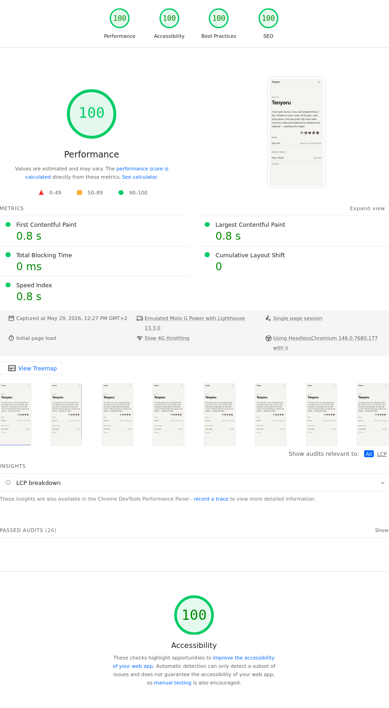

## My personal website, built with Hugo

> ## ⚠️ Warning
> I'm not a web developer, so I used AI to help build it.

**[PageSpeed](https://pagespeed.web.dev/report?url=https://tenyoru.io)** — performance audit

**[Social preview](https://socialsharepreview.com/?url=https://tenyoru.io)** — OG/Twitter card checker

## TODO
- [ ] Change `http` to `https` for the startup link once the site is live